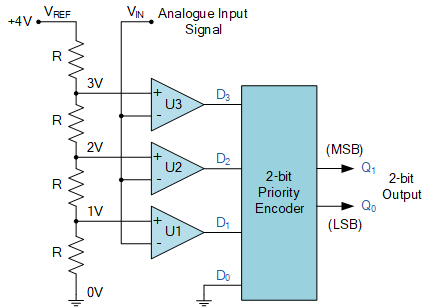

# Analog project docs

Koostada skeem, mis hindab valgustatust vahemikus 300-500 luksi ja kasutades selleks kolme LED-i:

- valgustatus on alla 300 luksi,
- valgustatus on vahemikus 300-500 luksi
- ja valgustatus on üle 500 luksi.

Lahenduses kasutada analoogkomponente (st Arduino Nano jääb valikust välja).

valgustatuse mõõtmine, kohvris oleva fotodioodi sobivus selleks

muundur: fotodioodi vool -> pinge

valgustatuse näidu tasemete määramine (komparaator ehk comparator)

täpsus võiks jääda +-10% suurusjärku võrreldes valgusmõõtjaga

## Initial scheme ideas

### Idea 1 (juri's)

MCP6002 has 2 opamps

- 1 for the current to convert to voltage
- other can be used for comparator

### Idea 2

[voltage to LED array](https://www.electronics-tutorials.ws/combination/analogue-to-digital-converter.html)

### LTspice schema of conjoined ideas

[Valgustugevuse mõõtmine fotodioodiga](./analog-scheme.asc)

## Protokoll 09:25

Uko + Karl:
spent 30min on making the breadboard implementation, then 2-3h on brute force guessing/testing different resistances to achieve correct led outputs on specified luxes.
