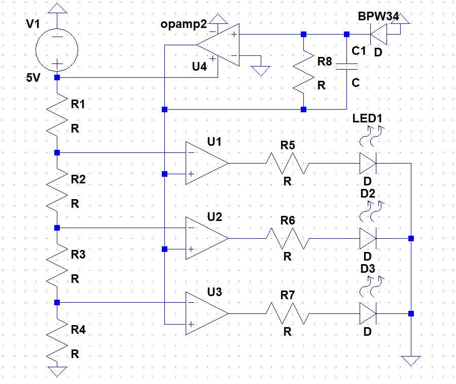

# Analog project docs

Koostada skeem, mis hindab valgustatust vahemikus 300-500 luksi ja kasutades selleks kolme LED-i:

- valgustatus on alla 300 luksi,
- valgustatus on vahemikus 300-500 luksi
- ja valgustatus on üle 500 luksi.

Lahenduses kasutada analoogkomponente (st Arduino Nano jääb valikust välja).

valgustatuse mõõtmine, kohvris oleva fotodioodi sobivus selleks

muundur: fotodioodi vool -> pinge

valgustatuse näidu tasemete määramine (komparaator ehk comparator)

täpsus võiks jääda +-10% suurusjärku võrreldes valgusmõõtjaga

## Initial scheme ideas

### Idea 1 (juri's)

MCP6002 has 2 opamps

- 1 for the current to convert to voltage
- other can be used for comparator

### Idea 2


[voltage to LED array](https://www.electronics-tutorials.ws/combination/analogue-to-digital-converter.html)

### LTspice schema of conjoined ideas

[Valgustugevuse mõõtmine fotodioodiga](./analog-scheme.asc)


## Manually get LUX -> Voltage at 500kO

Plottisin ja arduino plotterilt/monitorilt lugesin pinge väärtuseid V(out) sõlmes

| lux | V    |
|-----|------|
| 300 | 1.7  |
| 500 | 3.25 |

```sh
node ./llm-slop/ladder-calc.js --vin 5 --v1 3.25 --v2 1.7 --v3 0.1 --rtot 100000 --tol 0.01 --max-series 5 --inventory
```

analog\llm-slop> node ./ladder-calc.js --vin 5 --v1 3.25 --v2 1.7 --v3 0.1 --rtot 100000 --tol 0.01 --max-series 5 --inventory
Inputs:
  Vin=5 V, targets: V1=3.25 V, V2=1.7 V, V3=0.1 V
  Total S=100000 Ω, divider current ≈ 50.00 µA
Exact resistor values (from formulas):
  R1=35000.00 Ω, R2=31000.00 Ω, R3=32000.00 Ω, R4=2000.00 Ω
  Predicted nodes with exact R: V1=3.250 V, V2=1.700 V, V3=0.100 V

Searching discrete combinations (tol=±1.00%, max 5 in series per leg) …
  R4: 2×1 kΩ ≈ 2000.00 Ω (err 0.00 Ω, parts 2)
  R3: 2×1 kΩ + 3×10 kΩ ≈ 32000.00 Ω (err 0.00 Ω, parts 5)
  R2: 1×1 kΩ + 3×10 kΩ ≈ 31000.00 Ω (err 0.00 Ω, parts 4)
  R1: 1×220 Ω + 1×4.700 kΩ + 3×10 kΩ ≈ 34920.00 Ω (err 80.00 Ω, parts 5)

Predicted nodes with discrete picks:
  V1=3.253 V, V2=1.701 V, V3=0.100 V; current ≈ 50.04 µA

[LLM generated formulas](./llm-slop/gen-formulas.md)
