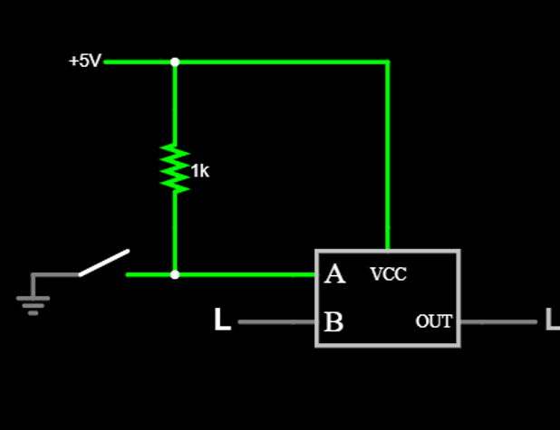
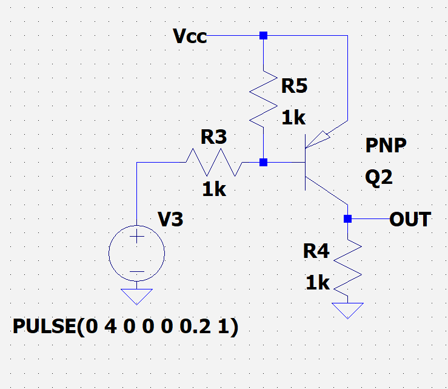
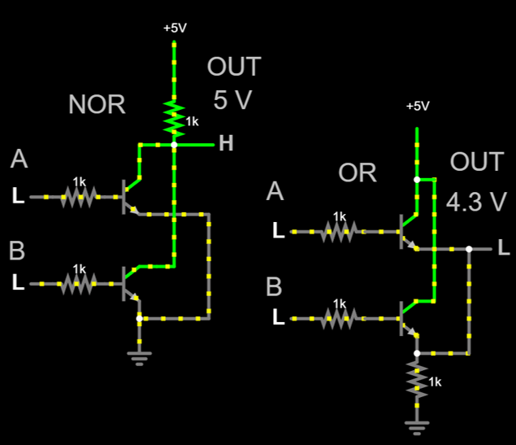
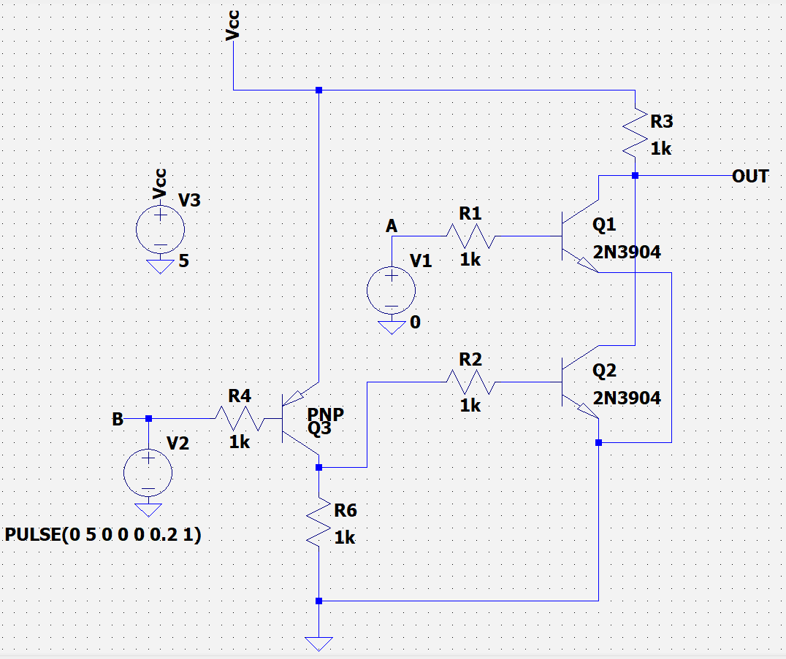
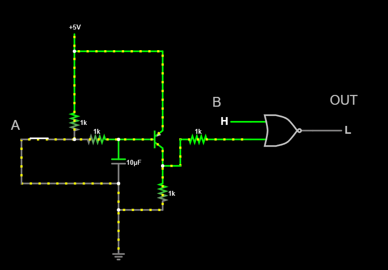
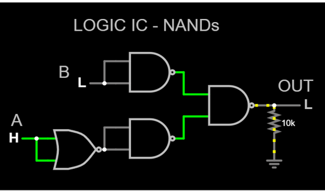
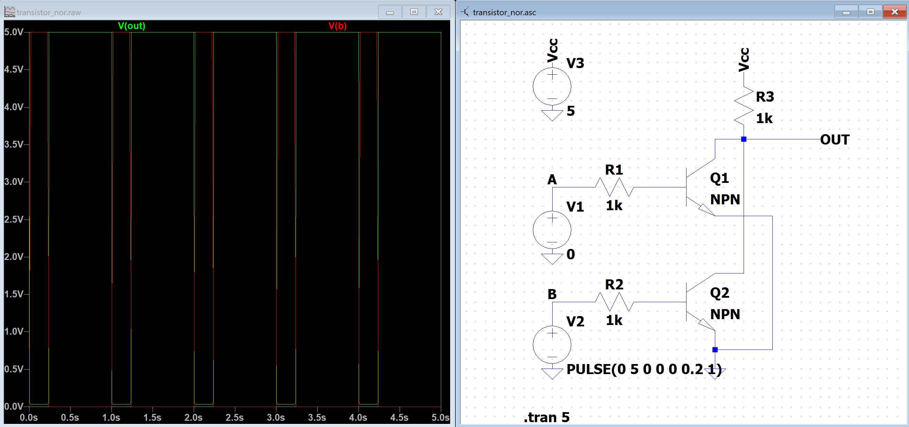
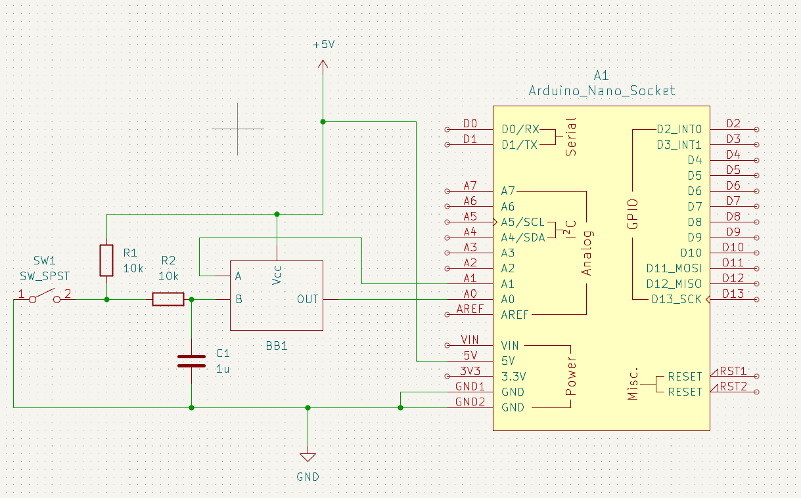

# Arduino Nano digisisendi laiendus

Luua skeem, mille sisendiks on 2 digitaalset signaali:
1. mehaaniline kontakt, mis on aktiivne kui loogiline 0 (Active Low)
2. suvaline digitaalne signaal, mis on aktiivne kui loogiline 1 (Active High)

Arvestades ühe inverteeritud sisendiga, käitub skeem kui OR värav

**Üldine lahendus**

**Tõeväärtustabel**

| Mehaaniline lüliti (A) | Digitaalne signaal (B) | Väljund |
|--------------------|--------------------|---------|
| 0                  | 0                  | 1       |
| 0                  | 1                  | 1       |
| 1                  | 0                  | 0       |
| 1                  | 1                  | 1       |

Disjunktiivne normaalkuju (DNF): A'B' + A'B + AB

Kleepimisseadus A'B' + A'B = A'

Minimaalne DNF kuju:
 A' + AB = A' + B

 Tesite sõnadega sisend A inverteeritakse ja seejärel OR'itakse sisendiga B.

---

Samuti sobib ka inverteeritud väljund
| Mehaaniline lüliti (A) | Digitaalne signaal (B) | Väljund |
|--------------------|--------------------|---------|
| 0                  | 0                  | 0       |
| 0                  | 1                  | 0       |
| 1                  | 0                  | 1       |
| 1                  | 1                  | 0       |

Minimaalne DNF kuju: AB'

**Järeldus:** 
Mõlemad AB' ja A' + B skeemid sobivad, kuna kohvris on nii NOR kui ka NAND. NOR skeemis on mehaaniline lüliti inverteeritud, NAND skeemis aga digitaalne signaal.

## Võimalikud lahendused

**Igas lahenduses peab olema inverter**

Näiteks inverter ühe PNP transistoriga.

### **Kasutades dioode**

NOR võib asendada ka NAND'ga kuna inverteri jaoks vahet pole, samuti võib kasutada PNP transistori

**+**
  * kerge kokku panna
  * nõuab vähe komponente

**-**
  * väljund langeb dioodi pingelangu võrra
    

### **Transistoritega - OR ja NOR**

Üldiselt kasutatakse NOR kuna väljund on otse toitega ühendatud, OR väljund on baas emitter siirde tõttu madalam kui totepinge.

**+**
  * vähe komponente

**-**
  * ?

### **Täislahendus koos inverteriga**

Kuigi see on inverteeritud OR, saab väljundi programmatiliselt inverteerida, sest see on Arduino sisendiks.

### PNP inverter + NOR IC

LTSpice pakub ainult OR ja AND integraalskeeme, seega selle skeem on Falstad'i simulaatoris.

### **Kasutades ainult antud loogiliste väravate integraalskeeme**

NOR võib asendada ka NAND'ga kuna inverteri jaoks vahet pole, samuti võib kasutada PNP transistori

Pull-down takistit võib välja jätta kui konfigureerida seda Arduino Nano's

**+**
  * ei tea
    
**-**
  * ...

## Testimine

Testimiseks kasutatud meetodid on LTSpice simulatioon ja makettplaadil katsetamine.

### LTSpice simulatsioon

Digitaalse signaali simuleerimiseks kasutati PULSE allikat, teist sisendit (mis peaks olema mehaaniline lüliti) oli lihtsalt pidevalt 5 V või 0 V, kuna simulatsioonis pole vahet milline neist lülitub. 

Signaalide interferentsi uurimist pole veel tehtud ning meetod, kuidas seda mõõta veel uurimise all.

### Makettplaadil katsetamine

Esialgu koostati KiCadis skeem, mis sisaldas mehaanilist lülitit ja Arduinoga juhtivat digitaalset signaali ning väljund ühendatud Arduino analoog sisendisse plottimiseks.

