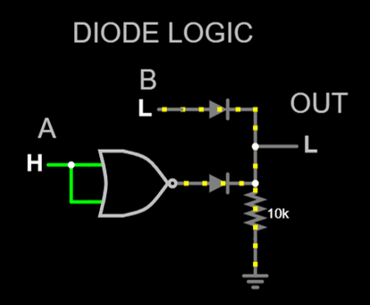

# Arduino Nano digisisendi laiendus

Luua skeem, mille sisendiks on 2 digitaalset signaali:
1. mehaaniline kontakt, mis on aktiivne kui loogiline 0 (Active Low)
2. suvaline digitaalne signaal, mis on aktiivne kui loogiline 1 (Active High)

Arvestades ühe inverteeritud sisendiga, käitub skeem kui OR värav

**Üldine lahendus**

## Võimalikud lahendused

**Kasutades dioode**

NOR võib asendada ka NAND'ga kuna inverteri jaoks vahet pole, samuti võib kasutada PNP transistori

**+**
  * kerge kokku panna
  * nõuab vähe komponente

**-**
  * väljund langeb dioodi pingelangu võrra
    

**Transistoritega - OR ja NOR**

Üldiselt kasutatakse NOR kuna väljund on otse toitega ühendatud, OR väljund on baas emitter siirde tõttu madalam kui totepinge.

**+**
  * vähe komponente

**-**
  * ?

**Kasutades ainult antud loogiliste väravate integraalskeeme**

NOR võib asendada ka NAND'ga kuna inverteri jaoks vahet pole, samuti võib kasutada PNP transistori

Pull-down takistit võib välja jätta kui konfigureerida seda Arduino Nano's

**+**
  * ei tea
    
**-**
  * ...

## Testimine

Testimiseks kasutatud meetodid on LTSpice simulatioon ja makettplaadil katsetamine.

### LTSpice simulatsioon

Suht keeruline simuleerida digitaalset skeemi ja skeemist ei saanud kasulikku infot. Digitaalse signaali simuleerimiseks kasutati PULSE allikat, teist sisendit (mis peaks olema mehaaniline lüliti) oli lihtsalt pidevalt 5 V või 0 V, kuna simulatsioonis pole vahet milline neist lülitub.

### Makettplaadil katsetamine

Esialgu koostati KiCadis skeem, mis sisaldas mehaanilist lülitit ja Arduinoga juhtivat digitaalset signaali ning väljund ühendatud Arduino analoog sisendisse plottimiseks.

